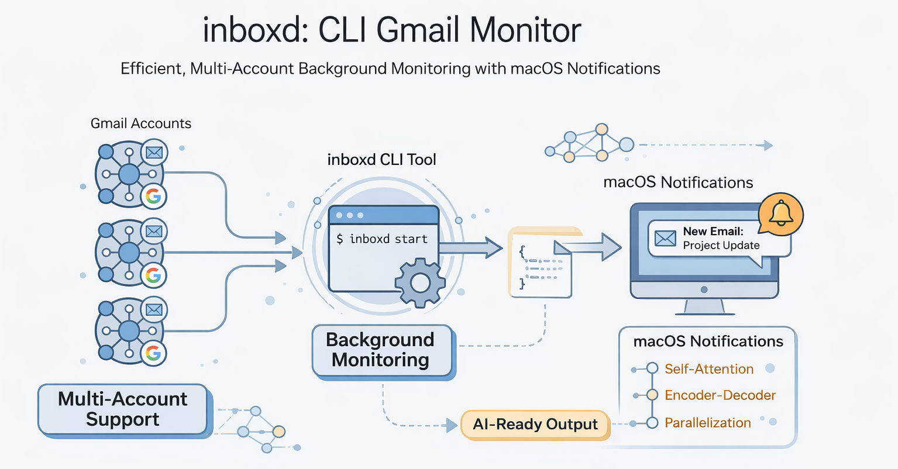

# Inboxd

[](https://www.npmjs.com/package/inboxd)
[](https://www.npmjs.com/package/inboxd)
[](https://opensource.org/licenses/MIT)

<a href="https://buymeacoffee.com/dparedesi" target="_blank"></a>

A CLI tool for monitoring Gmail inboxes with multi-account support and AI-ready output.



## Features

- **Multi-account support** - Monitor multiple Gmail accounts from one command
- **Delete & undo** - Safely trash or archive emails with undo support
- **Rules-based cleanup** - Save rules and apply them automatically
- **Thread operations** - View and act on entire conversations
- **Unsubscribe helpers** - Extract unsubscribe links and preference centers
- **Batch-friendly piping** - Stream IDs between commands
- **AI-ready output** - JSON mode for integration with AI agents
- **Interactive setup** - Guided wizard for first-time configuration

## Installation

```bash
npm install -g inboxd
```

## Quick Start

Run the interactive setup wizard:

```bash
inboxd setup
```

The wizard will guide you through:
1. Opening Google Cloud Console to create OAuth credentials
2. Validating and installing your credentials file
3. Authenticating your first Gmail account

That's it! You're ready to go.

## Manual Setup

If you prefer to set up manually:

### 1. Get Gmail API Credentials

1. Go to [Google Cloud Console](https://console.cloud.google.com/)
2. Create a project and enable the **Gmail API**
3. Configure OAuth consent screen (add yourself as test user)
4. Create OAuth credentials (Desktop app)
5. Download and save as `~/.config/inboxd/credentials.json`:

```bash
mkdir -p ~/.config/inboxd
mv ~/Downloads/client_secret_*.json ~/.config/inboxd/credentials.json
```

### 2. Authenticate

```bash
inboxd auth --account personal
```

### 3. Check Your Inbox

```bash
inboxd summary
```

## Commands

| Command | Description |
|---------|-------------|
| `inboxd setup` | Interactive setup wizard |
| `inboxd auth -a <name>` | Authenticate a Gmail account |
| `inboxd accounts` | List configured accounts |
| `inboxd summary` | Show inboxd summary for all accounts |
| `inboxd delete --ids <ids>` | Move emails to trash |
| `inboxd delete --sender <pattern>` | Delete by sender (with confirmation) |
| `inboxd delete --match <pattern>` | Delete by subject (with confirmation) |
| `inboxd delete --thread <threadId>` | Delete all messages in a thread |
| `inboxd restore --last 1` | Restore last deleted email |
| `inboxd archive --ids <ids>` | Archive emails (remove from inbox) |
| `inboxd unarchive --last 1` | Restore archived emails |
| `inboxd undo` | Undo the most recent delete/archive |
| `inboxd deletion-log` | View deletion history |
| `inboxd rules list|add|apply` | Manage and apply cleanup rules |
| `inboxd cleanup-auto` | Apply saved rules automatically |
| `inboxd read --id <id> --unsubscribe` | Extract unsubscribe details |
| `inboxd unsubscribe --id <id>` | Open/send unsubscribe actions |
| `inboxd thread --id <threadId>` | View thread summary |
| `inboxd search --ids-only` | Output IDs for piping |
| `inboxd delete --ids-stdin` | Read IDs from stdin |
| `inboxd logout --all` | Remove all accounts |
| `inboxd install-skill` | Install Claude Code skill for AI agents |

## Configuration

All configuration is stored in `~/.config/inboxd/`:

| File | Purpose |
|------|---------|
| `credentials.json` | Your OAuth client credentials |
| `accounts.json` | List of configured accounts |
| `token-<account>.json` | OAuth tokens per account |
| `deletion-log.json` | Record of deleted emails |
| `archive-log.json` | Record of archived emails |
| `undo-log.json` | Undo history for delete/archive |
| `rules.json` | Saved cleanup rules |
| `sent-log.json` | Record of sent emails |
| `usage-log.jsonl` | Local command usage analytics |
| `user-preferences.md` | AI preferences and rules (editable) |

## JSON Output

For AI agent integration, use the `--json` flag:

```bash
inboxd summary --json
```

Or use the `analyze` command for structured output:

```bash
inboxd analyze --count 20
```

## Rules & Auto Cleanup

Save rules and apply them automatically:

```bash
inboxd rules add --always-delete --sender "newsletter.com"
inboxd rules add --auto-archive --sender "github.com" --older-than 14d
inboxd rules apply --dry-run --account personal --limit 50
inboxd cleanup-auto --confirm
```

Generate suggestions from your deletion patterns:

```bash
inboxd rules suggest
inboxd rules suggest --apply
```

## Unsubscribe & Preference Centers

Extract unsubscribe details:

```bash
inboxd read --id <id> --unsubscribe
```

Open links or send one-click/email requests:

```bash
inboxd unsubscribe --id <id> --open
inboxd unsubscribe --id <id> --email
inboxd unsubscribe --id <id> --one-click
```

## Thread Operations

```bash
inboxd thread --id <threadId>
inboxd delete --thread <threadId> --confirm
inboxd archive --thread <threadId> --confirm
```

## ID Piping

```bash
inboxd search -q "older_than:30d" --ids-only | inboxd delete --ids-stdin --confirm
inboxd analyze --count 50 --ids-only | inboxd archive --ids-stdin --confirm
```

## AI Agent Integration

This package is designed to be used by both humans and AI agents. While the CLI works great on its own, it really shines when paired with an AI coding assistant like Claude Code.

### The Pattern: Agent-Ready CLI Tools

Traditional CLI tools are designed for humans. But with AI agents becoming capable of using tools, we can make CLIs that work for both:

1. **Structured output** (`--json`, `analyze`) for agents to parse
2. **Opinionated commands** with built-in safety (logging before delete, undo capability)
3. **Skills** that teach agents how to use the tool effectively

This package includes a **skill** that can be installed globally, enabling any Claude Code session to manage your inbox intelligently.

### Installing the Skill

After installing inboxd, run:

```bash
inboxd install-skill
```

This copies the inbox-assistant skill to `~/.claude/skills/`, making it available in all your Claude Code sessions.

The setup wizard (`inboxd setup`) also offers to install the skill automatically.

### What the Skill Enables

Once installed, you can ask Claude Code things like:

- "Check my emails" → Summary + recommendations
- "Clean up my inbox" → Identifies deletable emails, confirms before removing
- "What's important?" → Surfaces action-required emails only
- "Undo" → Restores recently deleted emails

The skill provides:

| Capability | Description |
|------------|-------------|
| **Triage** | Classifies emails into Important, Newsletters, Promotions, Notifications, Low-Priority |
| **Cleanup** | Identifies deletable emails and presents them for confirmation |
| **Restore** | Provides undo capability for accidental deletions |
| **Safety** | Never auto-deletes, enforces batch limits, always shows before deleting |

### Updating the Skill

The skill auto-updates when you update inboxd (if already installed). You can also update manually:

```bash
npm update -g inboxd
inboxd install-skill
```

Safety features:
- Won't overwrite skills not created by inboxd (uses `source: inboxd` marker)
- Creates `SKILL.md.backup` before replacing if you've modified the skill
- Use `inboxd install-skill --force` to override ownership check

### Why a CLI Instead of Raw Gmail API/MCP?

You could give an AI agent direct Gmail access via MCP (Model Context Protocol) or raw API. So why does `inboxd` exist?

**The CLI is a trust boundary.** It encodes safe behaviors as *code* rather than *instructions*.

| Concern | inboxd CLI | Raw Gmail MCP/API |
|---------|------------|-------------------|
| **Deletion safety** | Logs before trashing, always undoable | Just trashes—hope you don't need it back |
| **Restore capability** | `inboxd restore --last 5` works because we logged | Must find message IDs manually |
| **State across sessions** | Preferences file, deletion log, archive log persist | Stateless—AI must rebuild context each time |
| **Multi-account** | Named accounts, easy switching | One connection per account, manual management |
| **Human usability** | `inboxd summary` works in your terminal | MCP is AI-only |
| **Opinionated workflows** | `analyze --group-by sender`, `cleanup-suggest` | Raw primitives, AI must implement logic |

**The key insight:** With raw API access, the AI skill says "please log this deletion" and *hopes the AI complies*. With inboxd, logging is *enforced by code*—the AI can't skip it.

The skill layer adds domain expertise (triage rules, cleanup patterns, safety checks) on top of these guaranteed-safe primitives.

## Uninstalling

To remove the package:

```bash
npm uninstall -g inboxd
```

To also remove all account data and tokens:

```bash
inboxd logout --all
```

To completely remove all data including credentials:

```bash
rm -rf ~/.config/inboxd
```

**Note:** `npm uninstall` only removes the package itself. Your OAuth credentials and account data in `~/.config/inboxd/` are preserved so you can reinstall without reconfiguring. Use the commands above if you want to remove that data.

## Troubleshooting

**"credentials.json not found"**
Run `inboxd setup` or manually download OAuth credentials from Google Cloud Console and save to `~/.config/inboxd/credentials.json`.

**"Token expired"**
Delete the token file and re-authenticate:
```bash
rm ~/.config/inboxd/token-<account>.json
inboxd auth -a <account>
```

## License

MIT
